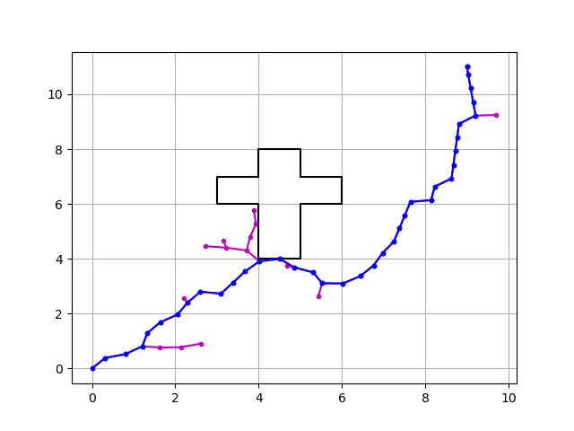
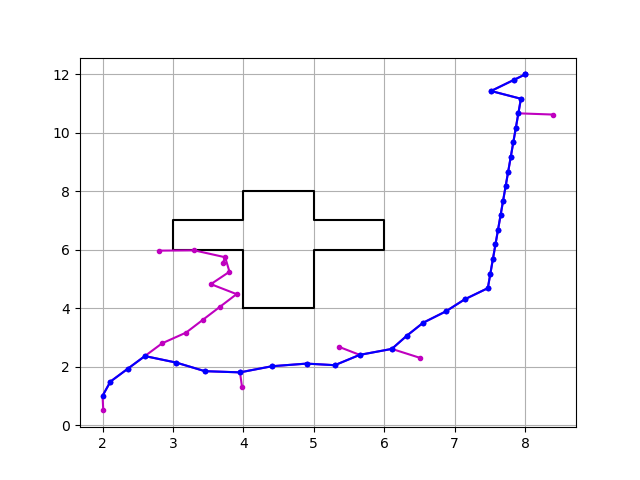

# RRT
C++ implementation of RRT along with obstacle avoidance and plotting

## Dependencies
- **python-dev**

For python 3.8:
```bash
sudo apt-get install python3-dev
```

For Python 2.7:
```bash
sudo apt-get install python2.7-dev
```
- **matplotlib**
## Libraries used for implementation
- Boost::geometry (https://github.com/boostorg/geometry)
- matplotlib-cpp (https://github.com/lava/matplotlib-cpp)

## Installation

```bash
git clone https://github.com/pranavgo/RRT.git
```

## Running the code
Make sure your current directory is the repository folder (i.e RRT)

### **To compile the code using gcc**


For Python 3.8:
```bash
g++ rrt.cpp -std=c++11 -I/usr/include/python3.8 -lpython3.8
```

For Python 2.7:
```bash
g++ rrt.cpp -std=c++11 -I/usr/include/python2.7 -lpython2.7
```

### **To run the executable file** 
```bash
chmod +x ./a.out
./a.out
```
**No of iterations for running is fixed to 500**

After running the file user needs to give certain inputs:

- *sampling probablity {float}* - to determine the rate of sampling ( should be between 0 to 1)
- *sampling radius {float}* - to set the sampling radius (preferred to be less than 1)
- *start_x {float*} - x position of the sarting point (should lie within the search space)
- *start_y {float}* - y position of the starting point (should lie within the search space)
- *goal_x {float}* - x position of the goal (should lie within the search space)
- *goal_y {float}* - y position of the goal (should lie within the search space)
  
## Setting the map

### **Defining the obstacle**
To define the obstacle, you should enter the boundary coordinates of the obstacle in `line 42` of `rrt.cpp` inside the *obstacle_array*:
```cpp
int obstacle_array[][2]={{3, 7}, {7, 7}, {6, 4}, {4, 4}, {4, 6}, {3, 6}};
```
The coordinates entered should lie within the search space of the map, they cab be in the form of any polygon.

### **Search Space**
The range of search space can be changed by changing th Max and Min valyes of the distribution_x and distribution_y in `line 54` and `line 55` respectively in `rrt.cpp` 
```cpp
std::uniform_real_distribution<float> distribution_x(0.0, 15.0);
std::uniform_real_distribution<float> distribution_y(0.0, 15.0);
```
## Example Plots

- **sampling_probablity = 0.4**

- **sampling_radius = 0.5**

- **start = [0,0]**

- **goal = [9,11]**





- **sampling_probablity = 0.8**

- **sampling_radius = 0.5**

- **start = [2,1]**

- **goal = [8,12]**



